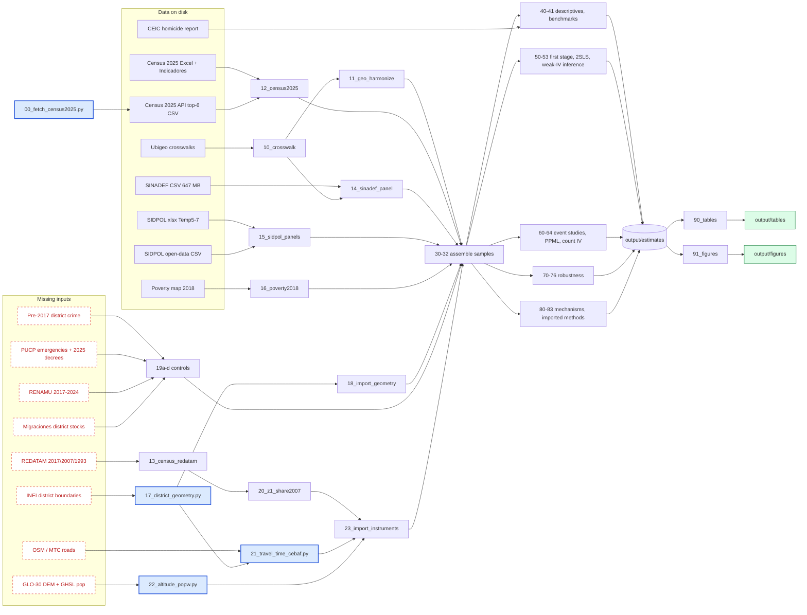

# Analysis Plan: Venezuelan Immigration and Crime in Peru

Prepared September 29, 2026, for the Crime-and-Migration project (PI: Diego Delgado, IPA). Draft for review; no design choice is final until Diego confirms it.

This plan sets out how the project will estimate the effect of Venezuelan settlement on homicides, extortion, and other crimes across Peru's 1,893 districts. The analysis runs in Stata 18 through `code/master.do`. The supporting literature, read in full text, is in [2026-09-29_literature_review.md](2026-09-29_literature_review.md). The design rests on three facts from that review. With one origin country, a settlement shift-share instrument is a continuous-intensity difference-in-differences (Borusyak, Hull, and Jaravel 2022, 23). Distance from a single entry point cannot be recentered in a credible way (Borusyak and Hull 2023). The death registry measures homicide trends better than levels (Mujica and Campos-Vásquez 2026, 12).

The mermaid chart below passed the Mermaid validator on September 30, 2026.

## Stata environment (checked 2026-09-29)

- Stata 18 SE at `C:\Program Files\Stata18\`, batch runs from Git Bash with `MSYS_NO_PATHCONV=1 "C:/Program Files/Stata18/StataSE-64.exe" /e do code/master.do` (without the variable, Git Bash rewrites `/e` as a drive path and Stata runs nothing).
- Installed in `C:\Users\DDelgado\ado\plus`: reghdfe 6.12.3 (out of date; SSC has 6.13.1), ftools, gtools, csdid, drdid, did_multiplegt, did_multiplegt_stat, binsreg, coefplot, estout, geonear, spmap, shp2dta.
- Not installed: ivreg2, ranktest, ivreghdfe, weakivtest, boottest, ppmlhdfe, ivppmlhdfe, acreg, plausexog, honestdid, ritest, did_multiplegt_dyn, jwdid, scpc.
- Stata 19's `ivregress 2sls, absorb()` cannot be combined with `vce(cluster)`, so ivreghdfe remains the IV engine even after an upgrade.

## Proposed analysis design (draft, for Diego's review)

**Timing constraint.** The census measures the Venezuelan-born share V_d only twice. In 2017 there were 47,481 nationally (INEI 2018, p. 7), and in 2025 there were 909,684 (census API file). Arrivals were concentrated in 2017-2019, with 2018 alone accounting for 50.3% of entries (Migraciones 2023, p. 15). SINADEF starts in 2017 and SIDPOL in 2018, so there is almost no pre-period in the main outcome data. Three consequences follow:

- The core IV is a long difference, 2017→2025, which is equivalent to a two-period panel with district fixed effects.
- Annual outcomes enter through event-study reduced forms on the instrument.
- Pre-trend tests need pre-2017 district crime data. Section "Missing data" covers this.

**Specifications** (d = district, t = year, p = province, r = department):

1. **First stage and 2SLS (long difference), main result.**
   ΔV_d = π·Z_d + X_d′λ + δ_r + u_d
   Δy_d = β·ΔV_d + X_d′γ + δ_r + ε_d
   - Δy_d is the change in outcome rate per 100,000: the 2023-2025 average minus the 2017-2018 average. SINADEF homicides are by residence; SIDPOL reports start in 2018.
   - X_d holds pre-period characteristics: 2007 or 2017 urbanization, log density, 2018 poverty, distance to Lima, a coast dummy and 2017 population.
   - Estimated with `ivreghdfe`, clustered by province (G ≈ 196), weighted by 2017 population.
2. **Instruments.**
   - **Z1, 2007-census Venezuelan share (Venezuela-born / population, REDATAM).** This is the Groeger et al. instrument at district level. With a single origin it is a continuous-intensity DiD (BHJ 2022, p. 23). It is sparse: fewer than 3,000 Venezuelans lived in Peru in 2007 (Boruchowicz et al., fn. 7). Robustness variants use the 2007 total foreign-born share and the 1993 share.
   - **Z2, road travel time from CEBAF Tumbes.** Knight & Tribin-style distance exposure. With one realized entry point, Borusyak-Hull recentering has no credible counterfactual entry points, so it is presented as a distance-exposure design. Controls for distance to Lima, coast and latitude-longitude quadratics (Kelly 2020) protect against gradient confounding. Warning: in Ecuador, distance to the entry point was a weak predictor of location (Olivieri et al. 2020).
   - **Z3, altitude.** Diego's proposal. It is used only as an over-identifying instrument together with Z1 or Z2, in the panel version with fixed effects, with a Hansen J test and exclusion sensitivity. It is never used alone (see memory `altitude-iv-recommendation`; Dell 2010, p. 1871).
3. **Event-study reduced forms (annual), for dynamics and pre-trends.**
   y_dt = Σ_{k≠2017} θ_k·(Z_d × 1[t=k]) + α_d + δ_rt + ε_dt
   - Estimated by OLS on rates with `reghdfe` and by PPML on counts with `ppmlhdfe`, with an exposure offset of log population. Chen & Roth (2024) argue against log(1+y).
   - `honestdid` provides sensitivity to pre-trend violations once pre-2017 data exist.
4. **Panel 2SLS as a secondary result.** The 2017 and 2025 census years, or the average outcomes around them, with district and year fixed effects. The instrument is Z_d × post. A variant adds altitude × post for over-identification.
5. **Count IV.** `ivppmlhdfe` with a split-panel jackknife (Kwon et al. 2026, p. 11), as a secondary result.
6. **Inference protocol.**
   - Cluster-robust first-stage F, equal to the effective F (MOP), and `weakivtest`.
   - The headline interval is the Anderson-Rubin confidence set, reported whatever F turns out to be (Andrews, Stock & Sun, p. 3).
   - tF-adjusted t intervals (Lee et al. 2022).
   - `boottest` WRE and wild-bootstrap AR tests at department level (G = 25).
   - `acreg` Conley standard errors at 50, 100 and 250 km cutoffs. SCPC and a spatial unit-root check with `spur`.
   - Delete-one-department and drop-Lima/Callao/Tumbes checks (Young 2022). A Kelly spatial-noise placebo.
7. **Outcomes, in pre-specified families.**
   - **Violence (SINADEF):** homicides, homicides of men aged 15-39, firearm homicides, and homicides by place of death.
   - **Police reports (SIDPOL):** extortion, robbery, theft, fraud and homicide for 2018-2025, with a 2025 break dummy. Robustness drops 2025 (OBNASEC-INDAGA 2026, p. 67).
   - **"Imported methods" (SIDPOL modalities 2024-2025, cross-section):** sicariato and homicide by firearm (PAF).
   - **Placebo:** suicides, traffic deaths and natural-cause deaths from SINADEF.
   - Multiple testing is handled with Romano-Wolf (`rwolf`, with `iv()` and `cluster()`) and sharpened q-values (Anderson 2008).
8. **Threats and checks.**
   - **Registry completeness:** department × year fixed effects (Vargas-Herrera et al. 2022).
   - **States of emergency:** district-month indicators from the PUCP database plus the 2025 decrees.
   - **COVID-19:** 2020-2021 × Z_d.
   - **Measurement error in V:** use the Migraciones Lima/Callao district stocks as a second measure, report the R² of V on the controls, and test whether census coverage varies with Z (Aydemir & Borjas 2011; Chalfin & McCrary 2018).
   - **Exclusion:** `plausexog` bounds (union of confidence intervals, and local-to-zero with γ̂ from a pre-period reduced form) and `imperfectiv` (Nevo-Rosen).
9. **Mechanisms and heterogeneity.**
   - Labor-market informality (2017 census) and 2018 poverty.
   - Tren de Aragua cities (Trujillo, Tacna, Arequipa, Chiclayo, Chimbote; InSight Crime 2025).
   - Victim nationality, if the SINADEF microdata can separate it (to be confirmed).
   - Age-sex composition, using the census share of young men.

## Pipeline (Stata 18, one `code/master.do`)

**Design rules**
- `master.do` holds `version 18`, the path globals (`$raw`, `$der`, `$est`, `$tab`, `$fig`, `$logs`), stage toggles `RUN_S0`-`RUN_S9` and `RUN_PY`, and `have` checks that skip scripts whose inputs are missing.
- Each script is run through a `runscript` wrapper that writes its own log to `output/logs/` and stops on a nonzero return code.
- Packages are pinned in `code/ado/plus` (`sysdir set PLUS`).
- Stages 4-8 write only `.ster` and `.dta` files to `output/estimates/`. Only stage 9 writes tables and figures, so nothing generated is ever edited by hand.
- Raw data stay read-only. Derived data go to `data/derived/`. Large intermediates (`sinadef_deaths_slim.dta`, `tmp/`, rasters, `.pbf`) are git-ignored.
- Python is used only for API fetches and GIS work (`code/gis/`), and it writes CSVs that Stata imports.
- `check_logs.do` asserts zero lines matching `^r\([0-9]+\);` or `no observations`. A plain `r(` grep would also match echoed commands like `display r(N)`.

**Scripts by stage** (folder `code/<stage>/`)
- **0_setup:** `00_install.do`
  - Installs from SSC: ivreg2, ranktest, ivreghdfe, reghdfe 6.13.1, ftools, weakivtest, avar, weakiv, boottest, ppmlhdfe, acreg, hdfe, plausexog, mvtnorm, rwolf, ritest, did_multiplegt_stat, jwdid, moremata, spur.
  - Installs from GitHub: ivppmlhdfe, scpc, honestdid.
  - Unverified: `tf` (fallback is a lookup table of Lee et al. critical values) and `imperfectiv`.
  - Ends with smoke tests on `sysuse auto`.
  - Also here: `utils/programs.do` (`fix_ubigeo`, `check_merge`, `to_hid`) and `utils/check_logs.do`.
- **1_build:**
  - `10_crosswalk` (RENIEC→INEI, cross-checked against CONCYTEC, adds the 4 missing districts) and `11_geo_harmonize` (2025 districts → 2007 parent districts `hid`, using the district creation laws in `lookups/district_splits.csv`).
  - `12_census2025`. Asserts 1,893 districts, 1,052,977 foreign-born and 909,684 Venezuelans. Flags `ven_censored` where Venezuela is not in the district's top six.
  - `13_census_redatam` (2017/2007/1993), then `14_sinadef_panel`.
    - SINADEF is imported in chunks. Raw homicides must equal 677 (2017) and 2,253 (2025).
    - Place of death is matched by name, because the `*_FALLECIMIENTO` fields have no ubigeo.
  - `15_sidpol_panels` (xlsx sheets Temp5-7; national totals compared with the open-data CSV and reported, not asserted, because robbery differs by 6-10% in every year of the two extractions), `16_poverty2018`.
  - `gis/17_district_geometry.py` → `18_import_geometry`.
  - Controls: `19a_emergencies` (uses SIDPOL's `DIST_EMERGENCIA` flag until the PUCP database arrives), `19b_renamu`, `19c_migraciones`, `19d_pre2017_crime`.
- **2_instruments:** `20_z1_share2007`, `gis/21_travel_time_cebaf.py` (OSRM on the Geofabrik OSM extract, with networkx on MTC roads as fallback), `gis/22_altitude_popw.py` (GLO-30 DEM weighted by GHSL 2015 population), `23_import_instruments`.
- **3_sample:** `30_pop_denominators`, `31_assemble_longdiff` → `ld_district.dta`, `32_assemble_panel` → `panel_dy.dta`, `panel_2p.dta`, `modalities_cs.dta`.
- **4_descriptives:** `40_summary_stats` (balance of X on each Z; R² of V on X), `41_benchmarks` (SINADEF vs CEIC department rates; SIDPOL xlsx vs CSV).
- **5_iv:**
  - `50_first_stage`: instrument sets Z1, Z2, Z1+Z2, Z1+Z3, Z2+Z3 and all three; KP F, effective F, `binsreg`.
  - `51_main_2sls`: `ivreghdfe … [aw=pop2017], absorb(dept_id) cluster(prov_id)`.
  - `52_weakiv_inference`: AR sets, `boottest` WRE/AR at G = 25, tF. Runs `ivreg2` with department dummies partialled out.
  - `53_panel_2sls`: Z × post, plus altitude × post as over-identification, Hansen J.
- **6_dynamics:** `60_es_ols` (`reghdfe`, absorb `hid dept_id#year`), `61_es_ppml` (`ppmlhdfe`, offset log population), `62_did_robust` (`did_multiplegt_stat` iv-was, `jwdid`), `63_honestdid` (runs once pre-2017 data exist), `64_count_iv` (`ivppmlhdfe` with jackknife).
- **7_robustness:**
  - `70_spatial`: acreg at 50/100/250 km, scpc, spur, Kelly noise placebo, ritest.
  - `71_leave_out`, `72_exclusion` (plausexog, imperfectiv), `73_placebos`, `74_measurement`.
  - `75_threats`: department × year FE, emergencies, COVID × Z, SIDPOL coverage-balanced sample.
  - `76_mht`: rwolf and sharpened q-values.
- **8_mechanisms:** `80_heterogeneity`, `81_tren_aragua`, `82_imported_methods` (2024-25 modalities cross-section), `83_victim_nationality` (off by default; see missing data).
- **9_export:** `90_tables` (`esttab` from `.ster` files → `output/tables/*.tex`), `91_figures` (coefplot, binsreg, spmap → `output/figures/`).

**Build order**
- **Week 1, with data already on disk:**
  - `master.do`, `00_install.do` and the utils scripts.
  - Build scripts 10, 11, 12, 14, 15, 16, 19a.
  - `41_benchmarks`, after entering the CEIC department rates from pp. 7-8 of the PDF into `lookups/ceic_homicide_rates.csv`.
  - In parallel, Diego exports the REDATAM 2017 and 2007 district tables and downloads the INEI GPKG, GHSL, GLO-30 and Geofabrik files.
- **Week 2:**
  - GIS scripts 17, 21, 22. Census and instrument scripts 13, 20, 23.
  - Sample assembly 30-32 and 40.
  - `50_first_stage`, which is the first decision point with Diego: how strong are Z1, Z2 and Z3?
- **Dry run:** a debug-only pass of scripts 30-51 can use stand-ins: the crosswalk's capital altitude and great-circle distance to CEBAF. Results from it are never reported.

## Missing data (checked 2026-09-29)

**What the files on disk show**

*SINADEF (1,578,149 records)*
- **Nationality:** there is no nationality or country-of-birth field. `PAIS_DOMICILIO` = VENEZUELA gives only 105 homicides, and it mostly means the person had no Peruvian address. So spec 9's victim-nationality split cannot be built from SINADEF.
- **Place of death:** recorded as names only, with no ubigeo.
- **Cause codes:** ICD-10 `CAUSA_A_CIEX` is missing for 79% of homicides. The free-text cause fields (PROYECTIL, ARMA DE FUEGO, PAF, BALA, DISPARO) flag 60.9% of homicides as firearm deaths, rising from 48% in 2017 to 71% in 2025. The firearm-homicide outcome therefore needs a text classifier, not ICD codes.
- **`MUERTE_VIOLENTA` categories for placebos:** suicide 6,399 and traffic 23,667.

*SIDPOL*
- **Coverage:** districts with any report went from 1,426 (2018) to about 1,700 (2022-2024).
- **2025 break:** it appears in both the xlsx and the open-data CSV. For example, robbery falls from 112,574 to 62,844 in the xlsx.
- **The two files are different series** (2018 robbery: 103,135 in the xlsx, 96,091 in the CSV). Use the xlsx throughout; the CSV has no homicide category.
- **Sicariato:** the modality sheets show 35 cases in 2024 and 33 in 2025, and PAF homicides 1,419 and 1,361. Sicariato is too sparse for a district outcome.
- **Consequence for the "imported methods" test:** it has to rely on extortion (2018-2025) and firearm homicides. Sicariato for 2018-2023 must be requested.

**Missing inputs, ranked**

| Priority | Need | Specs | Source | Access |
|---|---|---|---|---|
| Blocking | 2007 census Venezuela-born and foreign-born by district (Z1) | 1, 2 | REDATAM 2007, https://censos.inei.gob.pe/Censos2007/redatam/ | Online cross-tab, manual export (Diego) |
| Blocking | 2017 census Venezuela-born by district (ΔV); 2017 employment and informality; men 15-39 | 1, 8, 9 | REDATAM 2017, http://censos2017.inei.gob.pe/redatam/ | Manual export |
| Blocking | Pre-2017 district crime (pre-trends, honestdid, plausexog γ̂) | 3, 8 | INEI Registro Nacional de Denuncias 2016 open microdata (https://www.inei.gob.pe/media/DATOS_ABIERTOS/DELITOS/DATA/2016.zip); 2011-2015 editions and MINSA deaths 2003-2016 by request | Open (2016) and formal request. The 2016 file may contain names or addresses, so check it before loading, because that would make it Confidential. |
| Blocking | Road network and CEBAF point (Z2) | 1, 2 | Geofabrik Peru OSM (https://download.geofabrik.de/south-america/peru.html); MTC road SHP (https://portal.mtc.gob.pe/estadisticas/descarga.html); CEBAF −3.48466, −80.26082 | Open |
| Blocking | INEI district boundaries | 2, 6 | https://ide.inei.gob.pe/files/Distrito.rar | Open |
| Important | Venezuela-born count for districts where Venezuela is not in the top six | 1 | INEI request; in the meantime, bound it by foreign-born total minus the listed top-6 counts | Request |
| Important | DEM and population grid (Z3) | 2 | Copernicus GLO-30 (https://registry.opendata.aws/copernicus-dem/), GHSL POP (https://human-settlement.emergency.copernicus.eu/ghs_pop2023.php) | Open |
| Important | Migraciones district × year Venezuelan registrations (second measure of V) | 8 | Formal request. Public data covers only Lima/Callao districts in Migraciones (2023). | Request, 10 working days by law |
| Important | States of emergency by district | 8 | PUCP database of 1,536 decrees, 2000-2024 (email PUCP), plus 2025-2026 decrees coded from El Peruano; until then, the SIDPOL `DIST_EMERGENCIA` flag | Email and hand-coding |
| Important | SIDPOL sicariato and PAF 2018-2023; reporting units per district-year | 7, 8 | MININTER request | Request |
| Nice to have | 1993 census Venezuela-born (Z1 variant) | 2 | REDATAM 1993 | Manual export |
| Nice to have | RENAMU 2017-2025 (serenazgo) | 8 | datosabiertos.gob.pe | Open |
| Nice to have | Crime data source used by Groeger et al. | positioning | Email the authors | Email |

**Formal requests** under the TUO of Ley 27806 (DS 021-2019-JUS), through https://www.gob.pe/20399, all asking for aggregate counts only:
1. **Migraciones:** Venezuelan residents by district × year × sex × age group, 2016-2026, by permit type (PTP, CPP, CE).
2. **MININTER:** SIDPOL by district × month × modality, 2018-2025, under both the old and the harmonized extraction; sicariato and PAF homicides 2018-2023; reporting units per district-year; victim and offender nationality if recorded.
3. **MINSA:** deaths 2003-2016 by district × year × sex × age group × cause group; SINADEF 2017-2026 homicides by district × type of ID document (a nationality proxy).
4. **Ministerio Público, Observatorio de Criminalidad:** homicide victims by district × year, 2011-2025, with victim nationality.
5. **INEI:** Registro de Denuncias 2011-2015 district aggregates; census 2025 Venezuela-born for every district by sex and age.

Any record-level file with names, ID numbers or addresses (SIDPOL or Migraciones microdata, INEI Registro de Denuncias questionnaires) would be Confidential under IPA policy and must not be processed with Claude.

**Changes to the design that follow**
- Spec 7 "imported methods" uses extortion (2018-2025) and firearm homicides from the text classifier. Sicariato is added only if MININTER provides 2018-2023.
- Spec 9 victim nationality is off unless the MINSA or Ministerio Público requests succeed.
- Pre-trends start from 2016 INEI police reports only, until the other requests arrive.

## Gap in the literature and positioning

**Main threat to novelty (unverified).** Guerrero & Sviatschi (2025), "Mass migration and the expansion of criminal networks", working paper.
- We know it only from the summary in VoxDevLit *Organised Crime and Development* (Sept 2025, p. 10), which I read in full text.
- **Design:** "Leveraging the timing of Peru's imposition of migration restrictions on Venezuelan nationals". The restrictions raised demand for migrant smugglers and let Tren de Aragua expand.
- **Findings:** that expansion "led to significant increases in extortion, human trafficking, and sexual exploitation, particularly in areas where migrants concentrated."
- **Availability:** the full text is not public. It is not on Sviatschi's websites as of 2026-09-29.
- **Action before claiming contributions on extortion or organized crime:** email the authors and read the paper.
- **How our design differs:** they identify from the visa-driven demand for smuggling; we identify from the settlement stock across all 1,893 districts, with homicide deaths as an outcome through 2025.

**Candidate contributions, ranked** (novelty × credibility × feasibility)

1. **C1 + C2, the lead contribution: lethal violence, then the mix of crime.**
   - **C1:** the first causal estimate of how Venezuelan settlement affected homicide deaths across Peruvian districts, measured in vital registration, including the 2021-2025 surge.
   - **C2:** whether settlement shifts the mix of crime toward extortion while total reported crime stays flat.
   - **What prior work lacks:** Groeger et al. (2024) use provinces, police-reported crime through 2020 only, and no homicides. Knight & Tribin (2023) study Colombia, Ajzenman et al. (2023) Chile, and Marques (2025) Brazil.
   - **Extortion:** other than Guerrero & Sviatschi, the agent found no paper that estimates the effect of immigration on extortion in the host country.
2. **C3, as the mechanism section: diffusion of criminal methods.**
   - **Claim:** test whether settlement predicts when extortion and firearm killings start in a district and how they spread, as distinct from crime in general.
   - **Closest analogues:** Sviatschi (2022, *AER* 112(6): 1985-2024; working-paper version read) on deportations and gangs in El Salvador; Murphy & Rossi (2020, *JDE* 143: 102433; abstract only) on Chinese migration and Mexican cartels; Anelli, Pinotti & Porreca (2025, CEPR DP20972; abstract and introduction read) on Sicilian mafiosi fleeing to the US; Cabra-Ruiz, Rozo & Sviatschi (2025, IZA DP 17671) on origin-side effects in Venezuela.
   - **Tests:**
     - Specificity: extortion and firearm homicides respond, while theft, fraud and placebo deaths do not.
     - Timing: a duration model of when extortion starts in each district.
     - Diffusion: distance to dated Tren de Aragua hubs × year, conditional on the Venezuelan share (InSight Crime 2025).
     - Composition: an origin-state shift-share, if ENPOVE records Venezuelan state of origin, following Sviatschi (2022) and Anelli et al. (2025).
   - **Framing:** present this as the spread of methods, not as the nationality of offenders. InSight Crime (2023) documents Peruvian impostors using the Tren de Aragua brand.
3. **C5, perceptions versus measured crime.** Medium novelty. ENAPRES is not representative at district level.
4. **C4, migrants as victims.** Blocked by data. SINADEF has no nationality field, so this needs the MINSA or Ministerio Público requests.

**Suggested introduction** (a first draft for Diego):
> Between 2017 and 2025 Peru received close to one million Venezuelan migrants. Over the same years, homicides recorded in the death registry more than tripled, and reported extortion rose from 11.5 to 77.8 per 100,000 between 2019 and 2025. Officials attribute the rise to the inflow, and in particular to Venezuelan criminal groups said to have brought extortion and contract-killing methods with them. We estimate the effect of Venezuelan settlement on homicides, extortion and other crimes across Peru's districts, using death records and police reports through 2025. We then test whether any effect runs through the spread of specific criminal methods rather than through the labor-market and population channels the literature emphasizes.

Sources for the numbers: Mujica & Campos-Vásquez (2026, pp. 13-14) for SINADEF; OBNASEC-INDAGA (2026, pp. 29-30) for extortion; the 909,684 Venezuela-born counted in the 2025 census.

**Threats and responses**
- **Groeger et al. already cover Peru with the 2007-share instrument.** Replicate their fall in non-violent crime with SIDPOL 2018-2020 as a bridge, show where the results diverge after 2020, and add the travel-time instrument.
- **SINADEF measurement.** Department × year fixed effects, the natural-death placebo, the place-of-death version, and a benchmark against CEIC.
- **Census undercount, and the 2025 stock measured after treatment** (migrants may have left high-crime districts). Check against Migraciones stocks, and use the instrumented share.
- **Weak instruments.** AR sets as the headline inference.

**Target journals**
- *JDE*: it published Knight & Tribin, Murphy & Rossi, and Ibáñez et al.
- *AEJ: Applied*: it published Ajzenman et al.
- *REStat* or *JEEA*: only if the C3 composition test works.
- Fallback: *World Development* or *Economía LACEA*.

